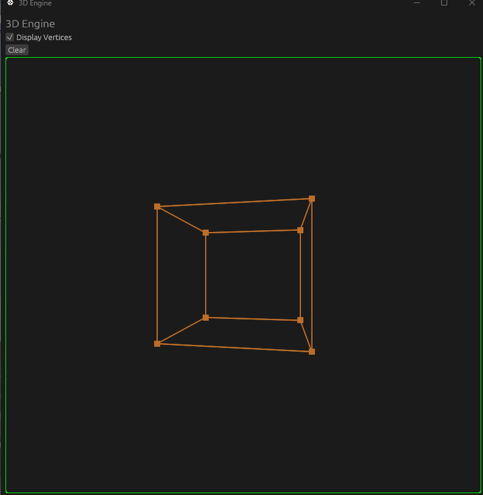
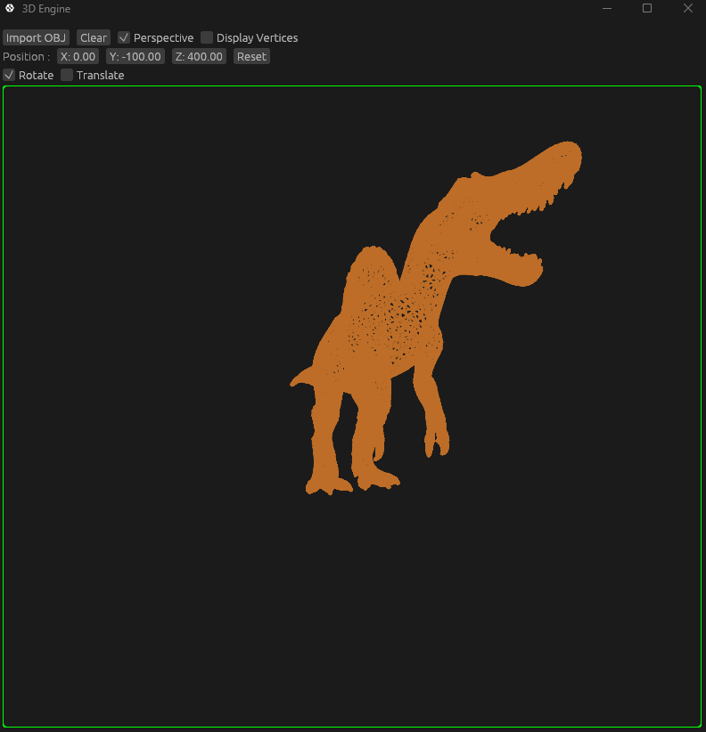
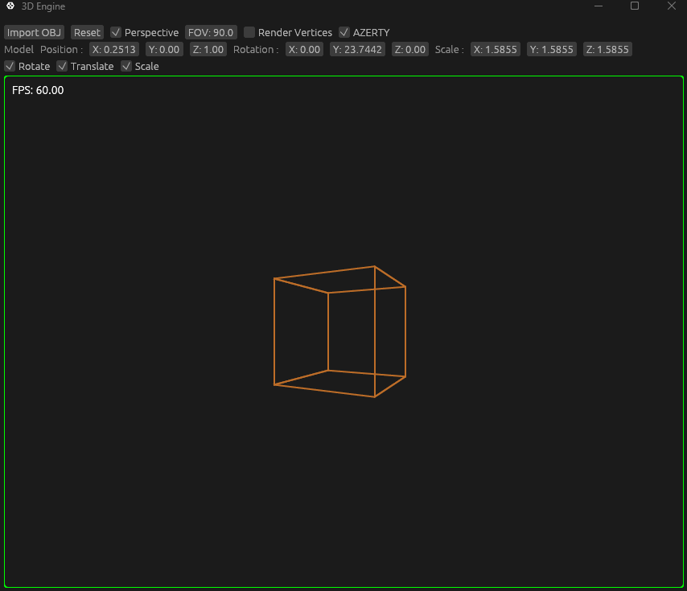

# 3D Engine

-Using Rust + egui 
-Using [This Tsoding video](https://www.youtube.com/watch?v=qjWkNZ0SXfo&list=WL&index=9&t=17s) as reference 

## Controls

-Move Camera = WASD (ZQSD if AZERTY is enabled) 
-Rotate Camera = Right Click 

## Features

-Render 3D Models Wireframe 
-Transform 3D Model 
-Move + Rotate Camera 
-Import OBJ File 
-Right-Handed 3D (Z forward = -Z, Camera start at 180° Y Rotation) Similar to : Blender, Godot, OpenGl, Vulkan

## Learnings

-Applied Maths : Linear Algebra, Intercept Theorem, Vectors Operations (Dot Product, Cross Product), Matrix Multiplication 
-Camera System 
-Rendering Pipeline 
-Graphics Programming in General 

-A lot of dead code / comments but I want to keep it as exemple (Old Engine) 

## To Go Further

-Optimisations (Triangulate Faces) 
-Render Faces 
-Calculate Face Normals 
-Lighting 
-Textures 

## Progress

