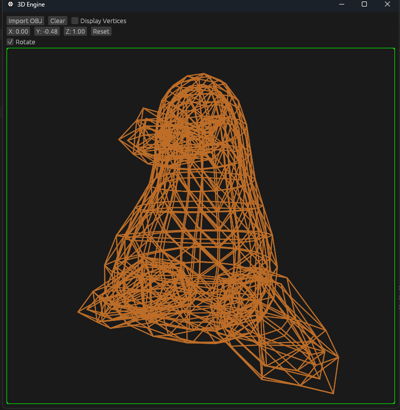
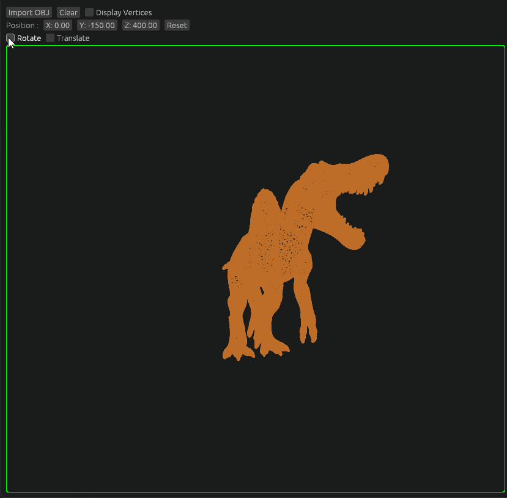

# 3D Engine

-Using Rust + egui 
-Using [This Tsoding video](https://www.youtube.com/watch?v=qjWkNZ0SXfo&list=WL&index=9&t=17s) as reference 

## Features

-Display 3D Models Wireframe 
-Import OBJ File 

## Learnings

-Linear Algebra 
-Camera System 
-Graphic Programming in General 

-TODO : Build egui App as WASM 

## Progress

